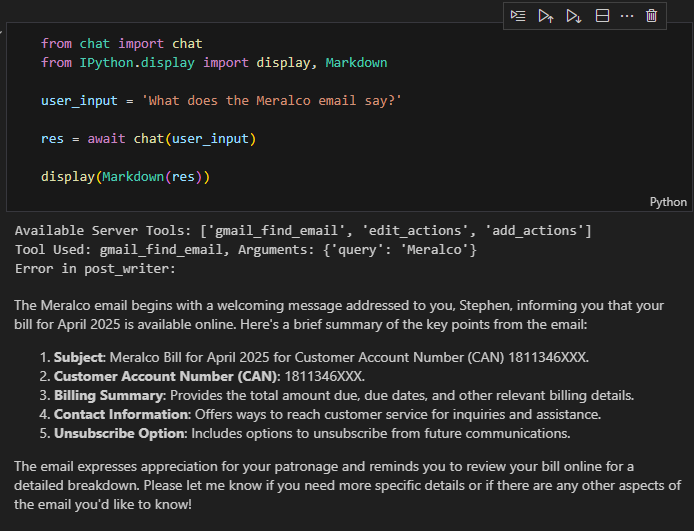

# MCP SSE Demo

This repository demonstrates using the [Model Context Protocol (MCP)](https://modelcontextprotocol.io/) with Server-Sent Events (SSE) to interact with a Zapier MCP server, enabling access to Gmail functionalities through an AI agent.

## Overview

The project uses an OpenAI model (`gpt-4o-mini`) to understand user requests, determine if a Gmail action (tool) is needed, and execute it via the Zapier MCP server.

## Key Files

*   `mcp_clients/zapier_mcp_client.py`: Contains the `GmailMCPClient` class responsible for connecting to the Zapier MCP server over SSE, listing available tools, and managing the connection.
*   `chat.py`: The chat application logic. It initializes the `GmailMCPClient`, connects to the Zapier server, retrieves tools, execute the tool call and pass the tool output to the LLM for synthesis. (i.e. the familiar function calling pattern)

## Setup

1.  **Clone the repository:**
    ```bash
    git clone <your-repo-url>
    cd <your-repo-directory>
    ```
2.  **Create a virtual environment and install dependencies:**
    ```bash
    python -m venv .venv
    source .venv/bin/activate
    pip install openai python-dotenv mcp nest_asyncio 
    ```
    *Note: You might need to adjust the `mcp` package name if it's different.*
3.  **Create a `.env` file:**
    ```
    touch .env
    ```
4.  **Add your credentials to the `.env` file:**
    ```dotenv
    OPENAI_API_KEY="sk-proj-..."
    ZAPIER_URL="https://actions.zapier.com/mcp/YOUR_SECRET_KEY/sse"
    ```

## Usage

The `chat.py` script provides an async `chat(user_input)` function. You can import and use this function in your own script or an interactive environment (like Jupyter, where `nest_asyncio` is often used) to interact with the chatbot.

Example in a Python script):

```python
import asyncio
from chat import chat

async def main():
    user_query = "Check my latest email."
    response = await chat(user_query)
    print(response)

if __name__ == "__main__":
    asyncio.run(main())
```

Example in Jupyter notebook




